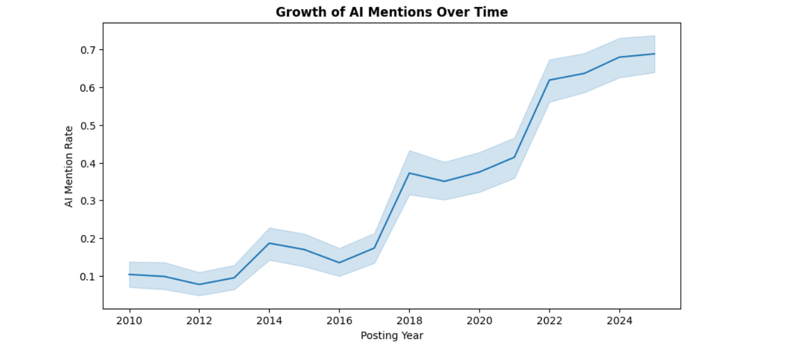

# 🌍 AI Impact on Global Job Market (2010–2025)

🚀 **Data Analysis & Visualization Project**  
📌 Exploring how Artificial Intelligence is transforming jobs, salaries, and skills worldwide.

---

## 📖 Project Overview

Artificial Intelligence is rapidly changing the global workforce.  
This project provides a complete **Exploratory Data Analysis (EDA)** of the AI job market from **2010 to 2025**.

The goal is to understand:

✅ Growth of AI-related jobs  
✅ Salary differences between AI vs Non-AI roles  
✅ Industry adoption of AI  
✅ Top AI skills in demand  
✅ Regional salary trends  

---

## 🎯 Key Objectives

- Analyze AI mention trends in job postings  
- Compare salary distribution for AI vs Non-AI jobs  
- Identify industries leading AI adoption  
- Explore the most demanded AI skills  
- Study global salary patterns by region  

---

## 🛠 Tools & Technologies Used

| Tool | Purpose |
|------|---------|
| **Python** | Data Analysis |
| **Pandas & NumPy** | Data Cleaning & Feature Engineering |
| **Matplotlib & Seaborn** | Data Visualization |
| **Kaggle Dataset** | AI Job Market Data (2010–2025) |

---

## 📊 Visual Insights

### 📈 AI Mentions Growth Over Time
AI job postings increased significantly after 2018.



---

### 💰 Salary Comparison (AI vs Non-AI Jobs)
AI-related jobs offer higher salary premiums.


---

### 🏢 Industry-wise AI Adoption
Tech and Finance industries lead global AI hiring.


---

### 🥧 AI Mention Share (Pie Chart)
AI roles are becoming dominant across industries.


---

## 🔍 Key Insights

📌 Major findings from the analysis:

- AI job listings grew rapidly after **2018**  
- AI roles consistently provide **higher salaries**  
- Tech & Finance sectors dominate AI adoption  
- Machine Learning, NLP, and Deep Learning are top demanded skills  
- North America shows the highest median salaries globally  

---

## 📂 Project Structure

```bash
AI-Job-Market-Analysis/
│
├── notebook/
│   └── ai_job_market_analysis.ipynb
│
├── dataset/
│   └── cleaned_ai_jobs.csv
│
├── screenshots/
│   ├── ai_trend.png
│   ├── salary_boxplot.png
│   ├── industry_ai.png
│   └── pie_ai_share.png
│
└── README.md

